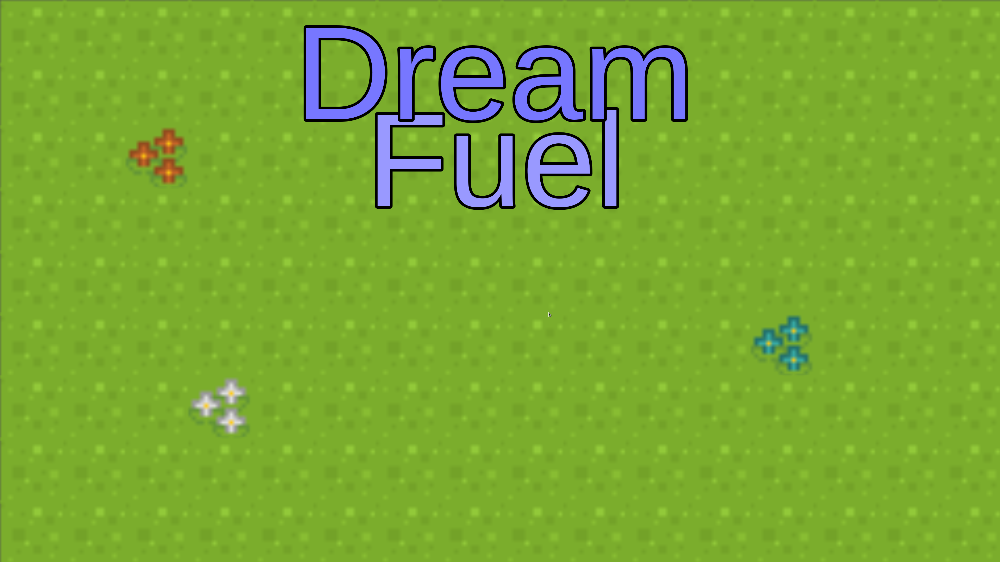

# Dream_Fuel_2d
 
This is a school projeckt about making a computer game. The game is far for complete. The most of the core part of the game is implementet.

The game is made in Godot 3.1.2 and the story idea can be found in docs/story.doc

The game it self is open sourced under the standard MIT and the audio and graphics assets are under different free licenses and they can be found under docs/Audio and Graphics

The story idea is under the default copyright.

To start the game press enter or space. You walk around with a,w,s,d and you use the mouse when a GUI is shown.

